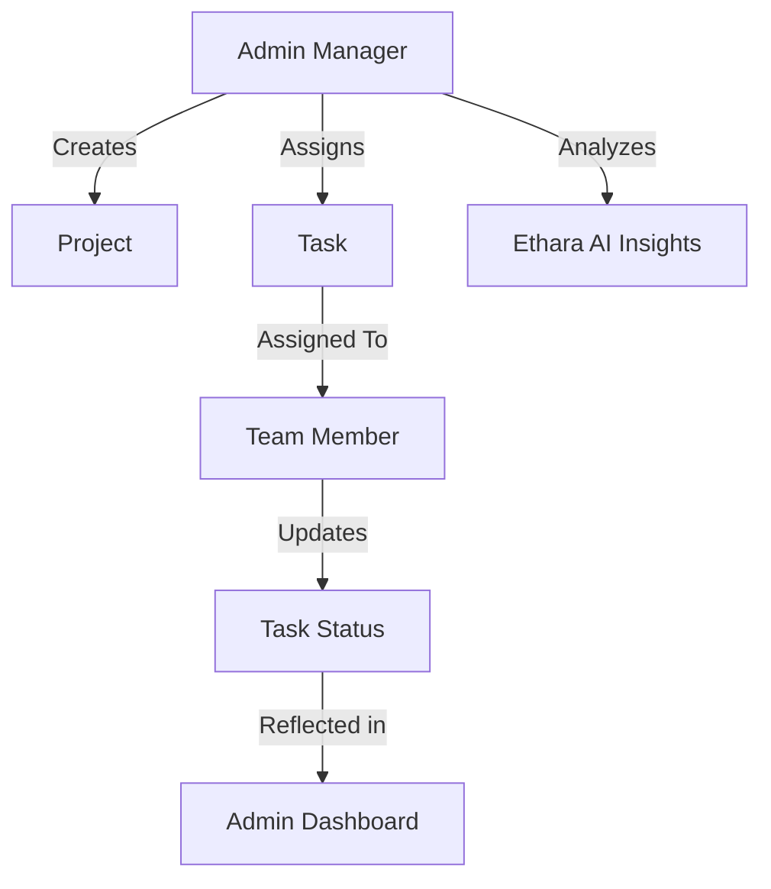
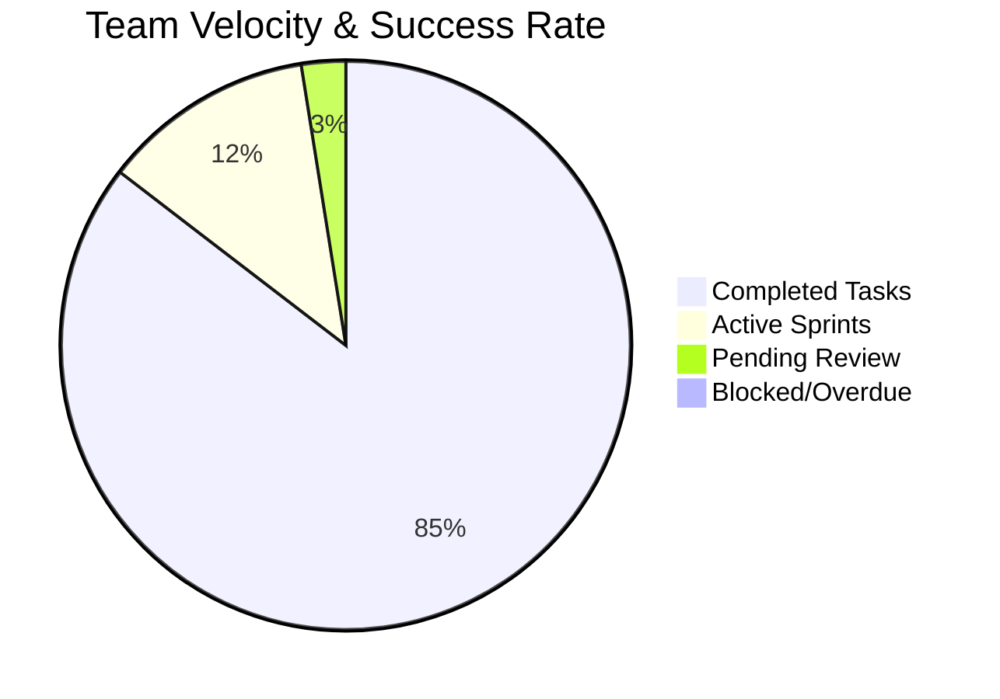
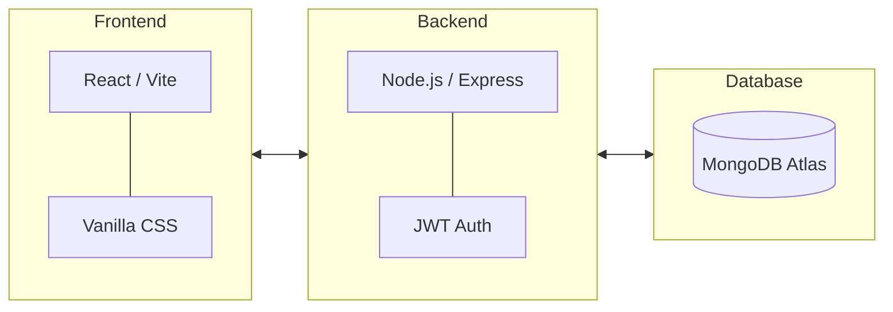

# 🚀 TaskFlow - Premium Team Task Manager
### *Powered by Ethara.ai*


**TaskFlow** is a production-ready, high-performance team management system designed for seamless collaboration. This edition is uniquely branded for **Ethara.ai**, featuring advanced AI-driven insights and a polished, premium UI.

## 🌐 Live Application
The application is live and can be accessed here:
**URL**: [https://team-task-manager-production-6d56.up.railway.app](https://team-task-manager-production-6d56.up.railway.app)

---

## 📊 System Workflow
The following diagram illustrates the collaborative relationship between Admin Managers and Team Members:



---

## 📈 Project Analytics (Sample)
The following chart represents the typical task distribution as tracked by the Ethara AI system:



---

## 🎬 Professional Video Demonstration
A comprehensive video demonstration of the workflow is included in the root directory:
**File**: `demo_recording.webm`

---

## ✨ Key Features

### 🛡️ Role-Based Permission Matrix
| Feature | Admin Manager | Team Member |
| :--- | :---: | :---: |
| View Dashboard Stats | ✅ | ✅ |
| Create & Manage Projects | ✅ | ❌ |
| Create & Delete Tasks | ✅ | ❌ |
| Assign Tasks to Members | ✅ | ❌ |
| Update Task Status | ✅ | ✅ (Own Tasks) |
| Generate AI Insights | ✅ | ❌ |

### 💎 Branded Ethara AI Widget
- **AI-Powered Reports**: Integrated dashboard widget for generating real-time project velocity and team performance summaries.
- **Premium Aesthetics**: Branded with custom gradients and micro-animations for a high-end feel.

### 🔍 Advanced Task Management
- **Live Search**: Instant filtering of tasks by title or description.
- **Smart Sorting**: Multi-criteria sorting (Priority, Due Date, Project Name) for efficient backlog management.

---

## 🛠 Architecture & Tech Stack


- **Security**: JWT + bcryptjs
- **Automation**: Playwright (for demo recording)

---

## 📂 Project Structure
```text
Team Task Manager/
├── backend/            # Express API Server
│   ├── models/         # User, Project, Task Schemas
│   ├── routes/         # Auth, Dashboard, Task, Project APIs
│   └── server.js       # Entry point
├── frontend/           # React Client
│   ├── src/pages/      # Dashboard, Projects, Tasks, Auth
│   └── src/index.css   # Premium Design System
└── demo_recording.webm # Professional Demo Video
```

---

## ⚙️ Setup & Installation

### 1. Prerequisites
- Node.js (v18+)
- MongoDB (Atlas or Local)

### 2. Environment Configuration
Create a `.env` file in the `backend/` directory:
`MONGO_URI`, `JWT_SECRET`, `NODE_ENV`, `PORT`

### 3. Installation
```bash
# Install root dependencies
npm install

# Start Backend & Frontend
npm run dev:backend
npm run dev:frontend
```

Experience TaskFlow live at: [https://team-task-manager-production-6d56.up.railway.app](https://team-task-manager-production-6d56.up.railway.app)
(Or visit `http://localhost:5173` for local development).

---

## 👤 Credits
Developed as a premium solution for Ethara.ai.

## 📄 License
MIT License
